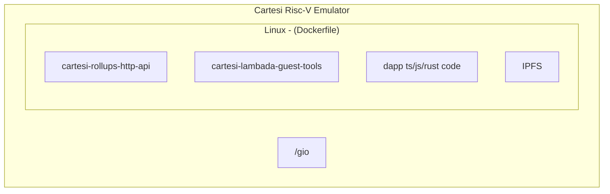

# Salsa

A Lambada Server

```mermaid
graph TB
    subgraph "Cartesi Risc-V Emulator"
        subgraph "Linux - (Dockerfile)"
            A[cartesi-rollups-http-api]
            B[cartesi-lambada-guest-tools]
            C[dapp ts/js/rust code]
            D[IPFS]
        end
        E["/gio"]
    end
```
