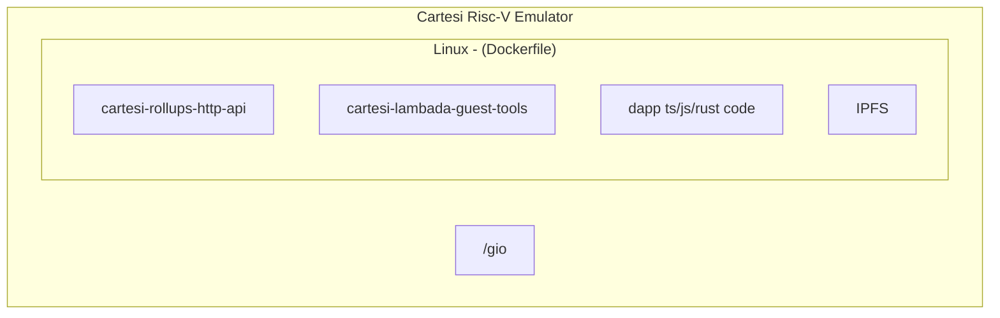

# Salsa

A Lambada Server



How to Run the server

```sh
cargo build
cd target/debug
./salsa 
```

Optionally, you can ser server's host and port and dapp address

```sh
./salsa --address 127.0.0.1:8080 --dapp 127.0.0.1:5080
```

Default address is 127.0.0.1:5005
Default dapp address is 127.0.0.1:5005

You can also pass a dapp command 

```sh
./salsa --dapp 127.0.0.1:5080 start
```